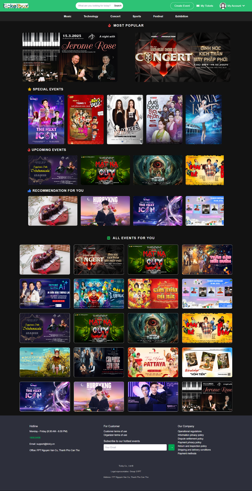
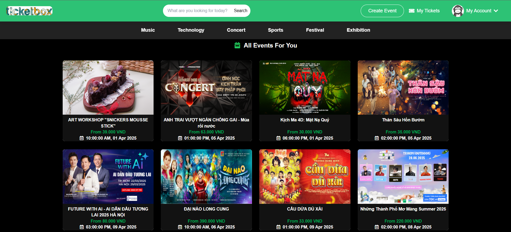
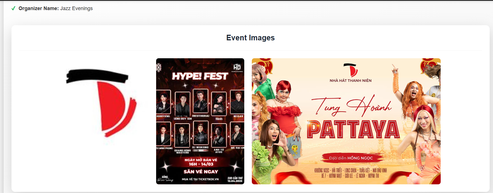
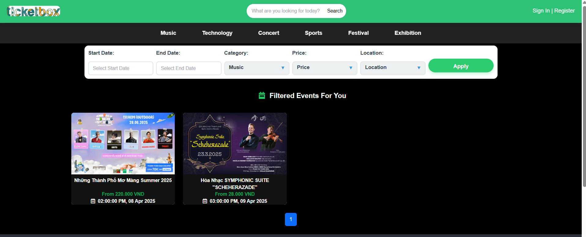
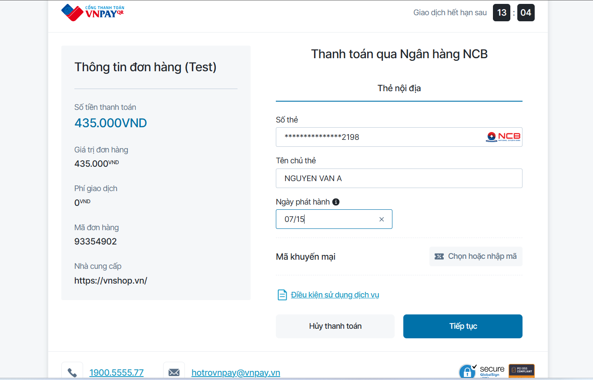
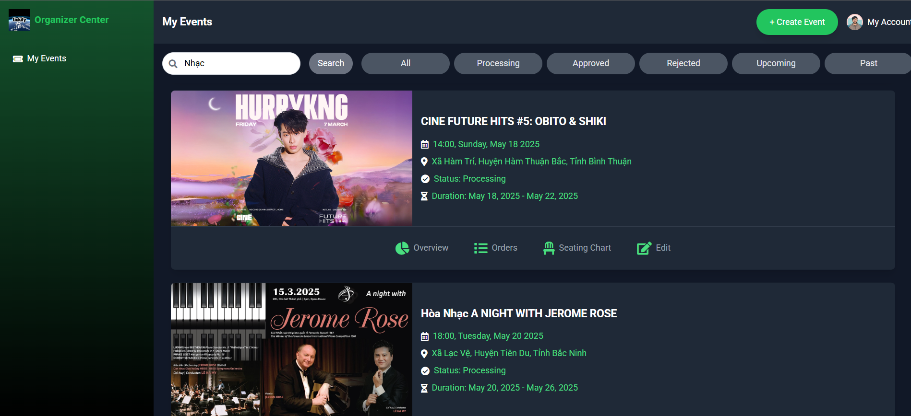
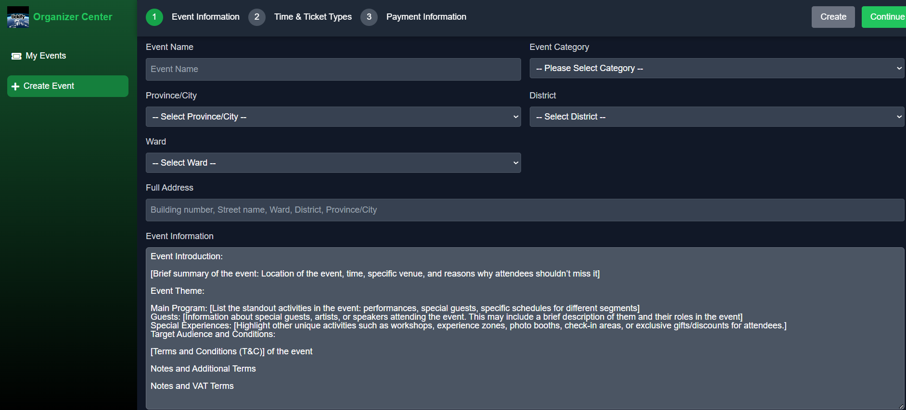
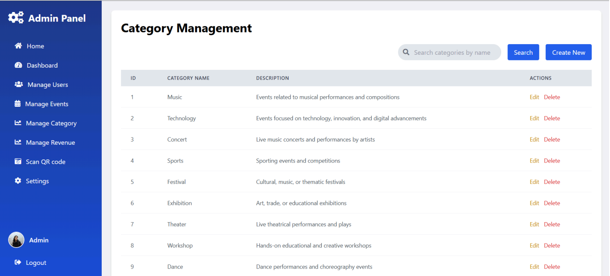

# Tickify - Online Event Booking System

**Tickify** is a professional event management and booking platform that connects event organizers with customers quickly and securely. The system supports full features from event creation, seat selection, and voucher application to online payment and QR code scanning for ticket validation.

## Key Features

### For Customers
- **Multi-method Login:** Supports logging in via Email, Google, and Facebook.
- **Event Discovery:** Filter events by category, name, or time.
- **Booking & Seat Selection:** Intuitive seat selection interface.
- **Voucher Management:** Apply vouchers to receive discounts.
- **Online Payment:** Integrated with the secure VNPay payment gateway.
- **Booking History:** Manage purchased tickets and view ticket details in QR code format.

### For Organizers
- **Event Management:** Create, update, and track the status of events.
- **Voucher Management:** Create promotional programs for events.
- **Order Management:** Track the list of customers who have purchased tickets.
- **Revenue Statistics:** View detailed revenue reports for each event.
- **Ticket Validation:** Check ticket validity via QR code scanning.

### For Administrators
- **Event Approval:** Approve or reject new events from Organizers.
- **User Management:** Manage Customer and Organizer accounts.
- **System Reporting:** Monitor the overall activity of the entire platform.

## Demo Screenshots

### Home Page


### Customer Interface
| Event List | Event Detail |
|:---:|:---:|
|  |  |

| Event Filter | VNPay Payment |
|:---:|:---:|
|  |  |

### Organizer Interface
| Dashboard | Create New Event |
|:---:|:---:|
|  |  |

### Admin Interface


## 🛠 Technology Stack

- **Backend:** Java 13, Servlet, JSP, JSTL.
- **Frontend:** HTML5, CSS3, JavaScript (Vanilla JS).
- **Database:** Microsoft SQL Server.
- **Payment:** VNPay API.
- **Image Storage:** Cloudinary API.
- **Security:** jBCrypt (Password Hashing), JWT (JSON Web Token).
- **Utilities:** ZXing (QR Code Generation), Jakarta Mail (OTP/Notifications), Jedis (Redis Client).

## Installation Guide

### Prerequisites
- **JDK:** Version 13 or higher.
- **Database:** MS SQL Server.
- **Server:** Apache Tomcat (v9.0 or v10.0, compatible with Jakarta Servlet).
- **IDE:** NetBeans or IntelliJ IDEA.

### Step-by-Step Setup
1. **Clone the Repository:**
   ```bash
   git clone https://github.com/hwangnhdev/tickify-event-booking-system.git
   ```
2. **Database Configuration:**
   - Create a new database in SQL Server.
   - Run SQL scripts (if provided) to create tables and sample data.
3. **Project Configuration:**
   - Since the `src/main/java/configs/` directory contains sensitive information, it is ignored by Git. You need to recreate the following files in the `configs` package:
     - `DBConfig.java`: Contains database URL, Username, and Password.
     - `AuthConfig.java`: Contains Google/Facebook Client ID and Client Secret.
     - `CloudinaryConfig.java`: Contains Cloudinary API Key and Cloud Name.
     - `MailConfig.java`: SMTP configuration for sending emails.
4. **Build & Run:**
   - Open the project in your IDE.
   - Right-click the project and select **Clean and Build**.
   - Run the project on the Tomcat server.

## Project Structure

- `src/main/java/controllers`: Handles user request logic.
- `src/main/java/dals`: Data Access Layer.
- `src/main/java/models`: Data objects (POJOs).
- `src/main/java/utils`: Support tools (DB connection, Email, QR Code).
- `src/main/webapp/pages`: JSP pages for the user interface.
- `src/main/webapp/components`: Reusable UI components (Header, Footer).

## Contact
If you have any questions, please contact via email: `hwang.huyhoang@gmail.com`

---
*Project developed by the SWP_Tickify team.*
